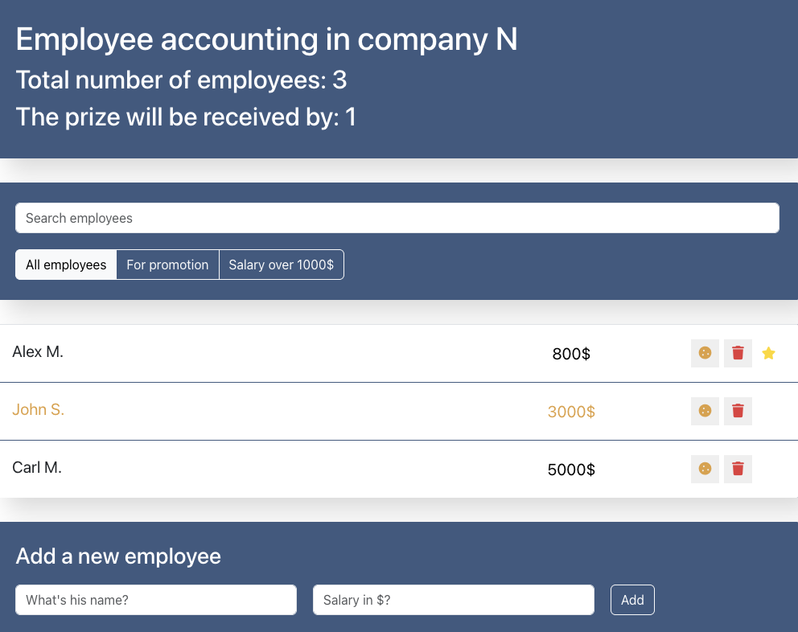

# Employee Manager App

A simple React application to manage employees. You can add, delete, search, and filter employees based on different criteria like salary or promotion status.

## 🚀 Features

- Add new employees with name and salary
- Delete employees
- Toggle "increase" (bonus) and "rise" (promotion) status
- Search employees by name
- Filter employees by:
  - Promotion status
  - Salary greater than $1000

## 📁 Project Structure

- `App.js`: Main application component with logic for managing state
- `app-info/`: Component showing total and promoted employees
- `search-panel/`: Search bar for filtering employees by name
- `app-filter/`: UI for filtering by promotion or salary
- `employees-list/`: List of employees with toggle/delete buttons
- `employees-add-form/`: Form to add new employees
- `app.scss`: Main SCSS styles

## 🖼 Screenshot



## 🛠 Technologies Used

- React (Class components)
- SCSS

## 💻 Getting Started

To run this project locally:

```bash
git clone https://github.com/Bogdan1412/employee-manager.git
cd employee-manager
npm install
npm start
